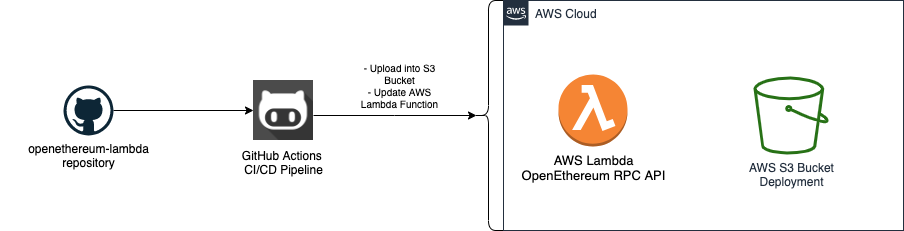

<h1 align="center"><code>Terraform OpenEthereum Lambda API</code></h1>

  Created by <a href="https://github.com/Gustavobelfort">Gustavo Belfort</a>

<a href="#">OpenEthereum Lambda</a> is a repository to ease the deployment of updates into the aws lambda created by <a href="https://github.com/Gustavobelfort/terraform-openethereum">terraform-openethereum</a>

## Features
* GitHub Actions pipeline
* Deployment upload into a S3 Bucket
* Deployment versioning saved into the S3 Bucket
* Deployment of updates into the terraform-openethereum AWS Lambda Function

## Why?

To ease the deployment of updates for the AWS Lambda API Function and to gather useful metrics from the OpenEthereum node!

## How it works

We use a GitHub Actions pipeline to build and then create a zip deployment of the application inside `./lambda`. This application is a simple client to interact with the RPC apis of our OpenEthereum node, retrieve useful informations from the node and then return those thru a API Gateway connected to the lambda function

The created zip deployment is stored into a versioned S3 Bucket and then uploaded to the AWS Lambda Function created by <a href="https://github.com/Gustavobelfort/terraform-openethereum">terraform-openethereum</a>

## General flow:

1. Create a new Branch following GitFlow recommendations
    - Work on the new feature/update/bugfix
2. Create a Pull Request into master:
    - The Lambda Deploy Pipeline is triggered
    - We build, install depedencies and then create a zip deployment for the aplication on `./lambda`
    - We upload the zip deployment to the S3 Bucket, but keeping the older verisons on the s3 bucket
    - We upload the latest zip deployment into the specified aws lambda

## Running locally
This repository is not planned to be run locally but you can do so by:

1.  <a href="https://www.npmjs.com/get-npm">Installing Node.js and NPM</a>
2. Issuing:
    - `cd lambda`
    - `npm install`
    - `zip -r openethereum.zip .`
3. Uploading the zip file to the AWS Lambda using preffered method (`aws cli` or `gui`)

## Contributors

- Gustavo Belfort <a href="https://github.com/Gustavobelfort">(Gustavobelfort)</a>

Feel free to open a PR or create an issue if you'd like to improve the project!
